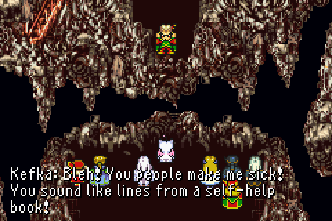

# Kefka

Kefka is an opinionated wrapper around the official Confluent Kafka Go client. Kefka offers a higher level API for consuming and producing messages along with offering common functionality such as retries and publishing failed messages to a dead letter topic. The motivation for Kefka came from writing the same boilerplate code over and over. Kefka attempts to abstract away the lower level details of working with the Confluent Kafka Go API and allow developers to focus instead on processing and handling message as part of their business/application logic.

The name Kefka comes from Kefka Palazzo, the main antagonist of the critically acclaimed video game Final Fantasy VI.

<p align="center">

</p>

Kefka offers four main types, each with their own purpose.

* Consumer: Used for Consumer messages from Kafka as a member of a consumer group. This is the most typical use case when consuming messages from Kafka.
* Reader: Used for consumer messages from Kafka but **not** as a member of a consumer group. This is intended more for use cases where you need to view the contents of a topic/partition but aren't consumer and persisting or processing the messages.
* Producer: Used for producing/publishing messages to Kafka
* AdminClient: Provides helper methods to work in tangent with Reader to fetch topics and partitions, offsets, watermarks, etc.

## Consumer, Reader, and Handler

At the heart of consuming/reading messages with Kefka is the Handler interface. The Handler interface defines a single method Handle which accepts a message and returns an error. The implementation of Handler supplied to the Consumer or Reader types is responsible for processing and handling messages as they are polled from Kafka. The Handler implementation should perform any validation, business logic, persistence, etc. and then either return nil, if there was no error, or return a non-nil error if an error occurred processing the message. Regardless, the Consumer will store the offsets and continue onwards to the next message but for proper instrumentation and logging it's important to correctly bubble up errors.

```go
type MyHandler struct {
	db *pgx.Conn
}

func (mh *MyHandler) Handle(msg *kafka.Message) error {
	// todo: store message in DB
}
```

Because Handler is an interface it is trivial to wrap Handler and create middlewares. Kefka provides two Handler middlewares out of the box, but you can easily create your own. Kefka has the following built in ready to leverage:

1. Retry - Will handle retrying a Handler that returns a retryable error up to the maximum attempts.
2. DeadLetter - Will publish a message to a configured dead letter topic when the Handler returns an error

You can chain as many handlers/middlewares as you need/want but the ordering of them can matter depending on the middleware and use case. A typical chain may look something like this:

Consumer --> Dead Letter Handler --> Retry Handler --> Handler

In the example above, should the handler actually processing the message return an error the retry handler will invoke it again if the returned error is retryable. If the error isn't retryable or all attempts are exhausted, then the dead letter handler would publish the message to the configured dead letter topic.

[//]: # (Kefka is a simple library that wraps the official Confluent Go Kafka library. My motivation for creating this library came from working with so many code bases that needed to either consume and/or produce messages from/to Kafka. I found myself writing a lot of the same code over and over and decided to move it into an open source library. Hopefully other people find it useful.)

[//]: # ()
[//]: # (Kefka is named after Kefka Palazzo, the main antagonist of the critically acclaimed video game Final Fantasy VI. )

[//]: # ()
[//]: # (<p align="center">)

[//]: # ()

[//]: # (</p>)

[//]: # ()
[//]: # (## Usage)

[//]: # ()
[//]: # (At the heart of Kefka are three types:)

[//]: # ()
[//]: # (1. Producer - Produces messages to Kafka asynchronously, although it has semantics to emulate producing synchronously. The Producer type also supports automatically marshalling of key and values.)

[//]: # ()
[//]: # (2. Consumer - Consumes messages from Kafka when using a consumer group. As messages are read/consumed they are handed off to a MessageHandler.)

[//]: # ()
[//]: # (3. Reader - Similar to Consumer type, but the Reader does not support using consumer groups. Reader is meant for use cases where you want to read through specific topics and partitions from a specified offset without any need to coordinate between different consumers. IE its okay for multiple consumers to be reading the same messages.)

[//]: # ()
[//]: # (Kefka also provides some convenient helper functions for handling common tasks for Kafka.)

[//]: # ()
[//]: # (For examples please refer to the examples directory in this repo.)