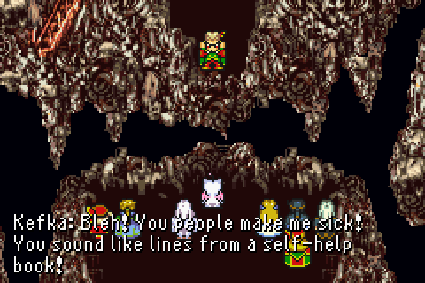

# Kefka

Kefka is a simple library that wraps the official Confluent Go Kafka library. My motivation for creating this library came from working with so many code bases that needed to either consume and/or produce messages from/to Kafka. I found myself writing a lot of the same code over and over and decided to move it into an open source library. Hopefully other people find it useful.

Kefka is named after Kefka Palazzo, the main antagonist of the critically acclaimed video game Final Fantasy VI. 

## Usage

At the heart of Kefka are three types:

1. Producer - Produces messages to Kafka asynchronously, although it has semantics to emulate producing synchronously. The Producer type also supports automatically marshalling of key and values.

2. Consumer - Consumes messages from Kafka when using a consumer group. As messages are read/consumed they are handed off to a MessageHandler.

3. Reader - Similar to Consumer type, but the Reader does not support using consumer groups. Reader is meant for use cases where you want to read through specific topics and partitions from a specified offset without any need to coordinate between different consumers. IE its okay for multiple consumers to be reading the same messages.

Kefka also provides some convenient helper functions for handling common tasks for Kafka.

For examples please refer to the examples directory in this repo.